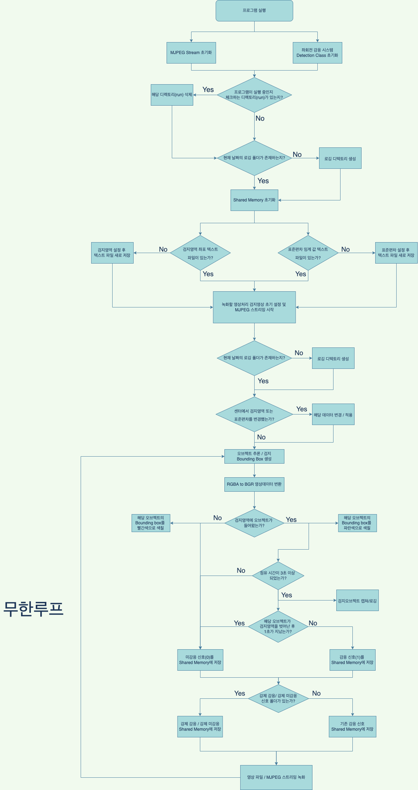

# 좌회전 감응 시스템

사용하는 소스
* 📁 c
	* 📄 detectNet.cpp: detectnet의 모델을 불러올 때 사용
	* 📄 detectNet.h
* 📁 examples
	* 	📁 detectnet
		 * 	📄 Detection.cpp: 좌회전 감응 시스템 클래스 소스
		 * 	📄 Detection.h
		 * 	📄 MJPEGWriter.cpp: MJPEG 스트리밍 소스
		 * 	📄 MJPEGWriter.h
		 * 	📄 detectnet-camera.cpp: 좌회전 감응 시스템 메인 소스
		 * 	📄 draw.cpp: 영상처리 로직 소스
		 * 	📄 function.hpp: 일반 소스 헤더
		 * 	📄 shared-memory.cpp: 공유메모리 소스
		 * 	📄 time.cpp: 시간 선언 소스
		 * 	📄 utility.cpp: 좌회전 감응 시스템 유틸 소스
* 📁 dbict
	* 	📁 python
		 * 	📄 uart.py: CAN 통신 파이썬 프로그램
		 * 	📄 consumer.py: kafka 센터 통신 파이썬 프로그램
		 * 	📄 producer.py: kafka 센터 통신 파이썬 프로그램
* 📁 utils
	* 	📁camera
		 * 	📄 gstCamera.cpp: 영상데이터 input 관련 세팅 소스
		 * 	📄 gstCamera.h


****
1. 초기설정
```
$ sudo apt update
$ sudo apt install git cmake libpython3-dev python3-numpy
$ git clone http://github.com/nFeus/left_detectnet
$ mv left_detectnet jetson-inference
$ cd jetson-inference
$ cd build
$ cmake ../
$ make -j$(nproc)
$ sudo make install
$ sudo ldconfig
```


2. `~/.bashrc` 파일에 아래 추가
```
alias url="vi /home/user/jetson-inference/dbict/control/url.txt"
alias start="sh /home/user/jetson-inference/dbict/script/start.sh"
alias delete="echo '123' | sudo -S rm  /home/user/jetson-inference/dbict/control/region.txt"
alias go="cd /home/user/jetson-inference/build"

alias oo="mkdir /home/user/jetson-inference/dbict/control/uarton"
alias ox="rmdir /home/user/jetson-inference/dbict/control/uarton"
alias xo="mkdir /home/user/jetson-inference/dbict/control/uartoff"
alias xx="rmdir /home/user/jetson-inference/dbict/control/uartoff"

echo "123" | sudo -S sh /home/user/jetson-inference/dbict/script/start.sh
```

3. 터미널 재실행 후 `url`입력해 카메라 URL을 쓴 후 저장

4. `start`를 입력 후 검지영역 설정 후 실행

****

## 시스템 로직

****
